<div align="justify">

# Tutorial – from a Mecabricks scene to smooth, render-ready parts

<!-- Pictures: Blender 5.2.2, the Italian Riviera scene, yellow numbered markers, 1896 px wide
(the text column at 2x); made with the scripts in _CLAUDE_/scripts/tutorial (local). -->

This tuto­rial takes you through the whole work­flow once, step by step. It uses the *Italian
Riviera* as example – a [Mecabricks](https://www.mecabricks.com) scene with 3297 parts of 810
dif­fer­ent kinds.

> **Example scene:** [Italian Riviera](https://www.mecabricks.com/en/models/qxv4E8VdadJ) by
> **Scrubs**, the devel­oper of [Mecabricks](https://www.mecabricks.com) – thank you for the model.

**You need:** Blender 4.5 LTS or newer with the add-on installed ([Install](#0-install-the-add-on)),
and a scene built in [Mecabricks](https://www.mecabricks.com) and imported into Blender with the
Mecabricks Advanced add-on.

**Time:** about 10 minutes of work; the con­ver­sion itself takes about 2 minutes for this scene.

<!-- IMAGE T00: before / after – the same close-up rendered from the import and after Apply -->

**How the idea works:** Mecabricks parts are mod­elled for real-time display: flat faces, hard
corners, round shapes made of a few segments. A sub­di­vi­sion surface makes them smooth – but
without guid­ance it rounds every­thing, and a brick looks like soap. Ren­der­bricker first decides
for every edge whether the real part is sharp or round there (a *crease*), fol­low­ing a rule set
that was built and checked part by part against photos of the real elements. Then it bakes the
sub­di­vided result into a copy of each part mesh. All links of a part – a scene may use the same
brick a thou­sand times – share that one copy, and the imported mesh stays untouched in the file.

Every step below has the same struc­ture: **what it is for**, the **num­bered actions** (the numbers
match the markers in the picture), a **check** that tells you it worked, and an optional **why**.

Con­tents: [0 Install](#0-install-the-add-on) · [1 Open and save](#step-1-open-and-save-the-scene) ·
[2 Set­tings](#step-2-settings) · [3 Apply](#step-3-apply) · [4 Check](#step-4-check) ·
[5 Compare](#step-5-compare-with-the-import) · [6 Render](#step-6-render) ·
[7 Save As and the cache](#step-7-save-as-and-the-cache-file) ·
[8 Large scenes](#step-8-large-scenes-convert-headless) · [9 Undo every­thing](#step-9-remove)

---

## 0. Install the add-on

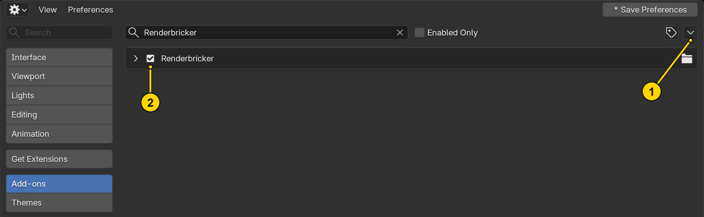

**[⬇ Down­load renderbricker-*version*.zip](https://github.com/Renderbricks/Renderbricker/releases/latest)** (latest release)

1. *Edit → Pref­er­ences → Add-ons*, open the menu at the top right and choose
   **Install from Disk…**, then pick the zip.
2. Tick **Ren­der­bricker** to enable it.

**Check:** in the 3D view­port, press **N** – the sidebar has a tab **Ren­der­bricker**.

> **Start Guide** at the top of the panel leads through the steps below inside Blender, one step
> at a time with the explanations.

---

## Step 1: Open and save the scene

**What it is for:** the add-on writes its copies into a cache file next to the scene and saves
the scene when it is done – the scene needs a file first.

Open the imported scene – here the [*Italian Riviera*](https://www.mecabricks.com/en/models/qxv4E8VdadJ),
as it came from [Mecabricks](https://www.mecabricks.com).

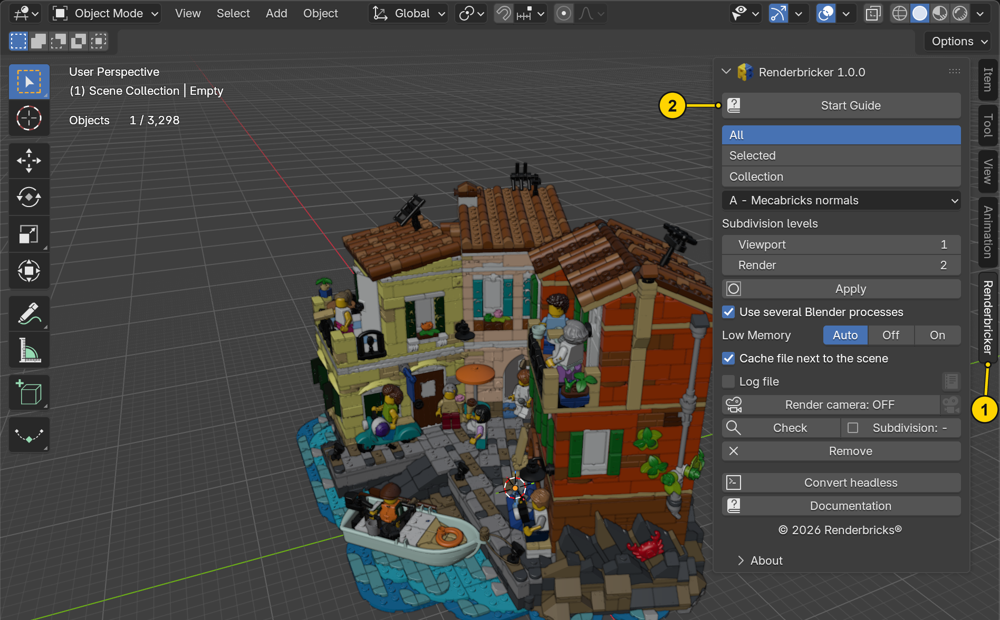

1. Press **N** in the 3D view­port and click the tab **Ren­der­bricker**.
2. Optional: **Start Guide** leads through the fol­low­ing steps inside Blender.
3. Save the scene under the name you want to keep (*File → Save As*). The cache file will carry the
   same name:

   ```
   Italian_Riviera_Tutorial.blend  →  Italian_Riviera_Tutorial_rbcache.blend
   ```

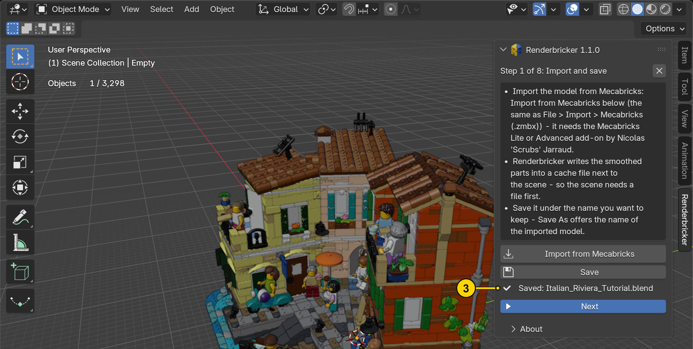

**Check:** the guide shows **✓ Saved:** with the file name (3); without the guide, the title bar
of the Blender window shows it.

---

## Step 2: Settings

**What it is for:** the defaults suit most scenes; here is what they mean. For the Italian Riviera
all of them stay as they are.

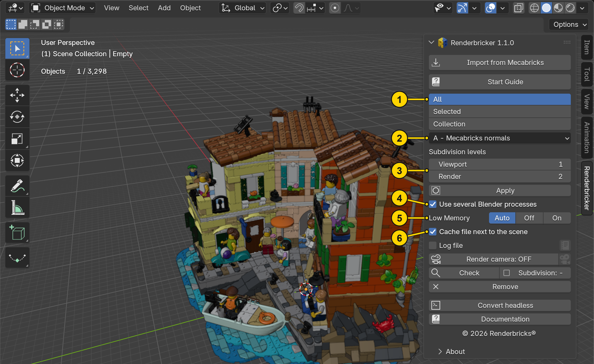

1. **All** – every part of the scene. *Selected* con­verts only the objects selected in the view­port
   or the Out­liner, *Col­lec­tion* the parts of chosen col­lec­tions (see below).
2. **A – Mecabricks normals** – keeps the shading of the import. *B* com­putes it from the smoothed
   surface and gives crisper logos on the studs.
3. **View­port 1 / Render 2** – smooth enough to judge the view­port, full quality in the render.
4. **Use several Blender pro­cesses** – on; larger scenes are con­verted by several Blenders in the
   back­ground at the same time. How many depends on the pro­ces­sor and the free memory; each of
   them uses several pro­ces­sor cores itself.
5. **Cache file next to the scene** – on; the smoothed parts go into a file of their own and the
   scene file stays small.

**Log file** (off) also writes the results of Apply and Check, with the full list of prob­lems, into
a file next to the scene: `<scene>_Renderbricker.log`.

**Why two levels:** level 2 has three to four times the faces of level 1. The view­port stays fast
with level 1, and F12 switches to level 2 only while it renders.

### Only some collections

A large scene can be con­verted piece by piece.

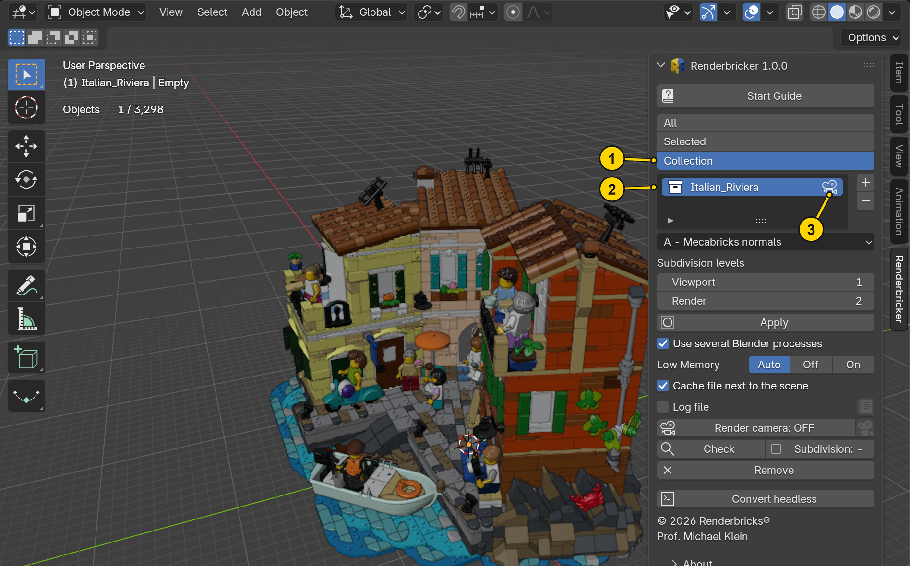

1. Choose **Col­lec­tion**. The list starts empty.
2. Click the col­lec­tion in the Out­liner and press **+** – it appears in the list. Several col­lec­tions
   can be listed; **−** takes the selected one out of the list (the col­lec­tion itself stays).
3. The **camera icon** marks a col­lec­tion for the render camera (step 6): with the camera on, only
   the marked col­lec­tions are shown and rendered.

Parts outside the chosen col­lec­tions stay as imported.

### Levels above 2

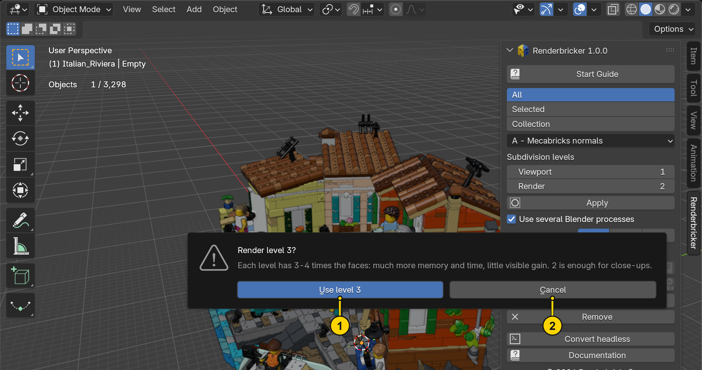

Every level has three to four times the faces of the one below. A level above 2 is asked first:
**Use level 3** (1) sets it, **Cancel** (2) keeps the level you had.

---

## Step 3: Apply

1. Press **Apply**.

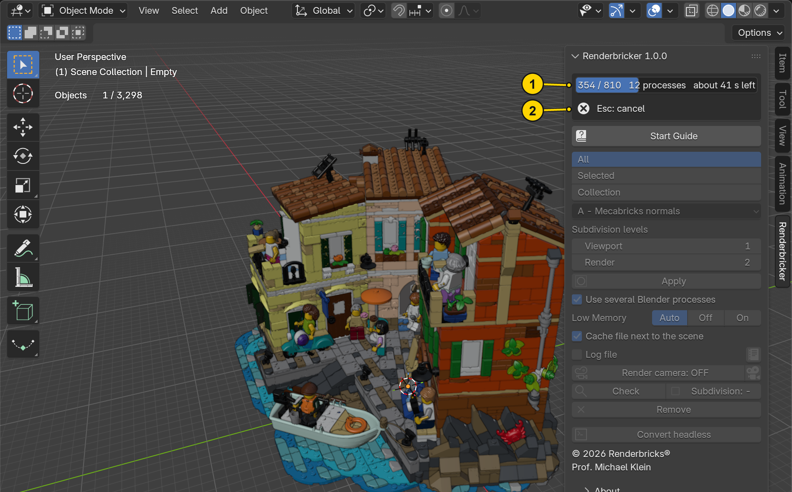

A progress bar shows the parts done and the time left (1); **Esc** cancels (2). With *Use several
Blender pro­cesses*, Blenders in the back­ground share the work – for the Italian Riviera twelve of them
con­verted the 810 dif­fer­ent parts in 84 seconds. At the end the scene is saved.

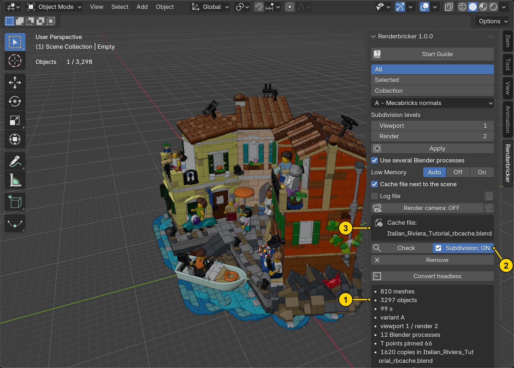

**Check:** the summary lists what was done (1): 810 meshes for 3297 objects, the time, the set­tings
and the copies written into the cache file. The button next to *Check* now reads **Sub­di­vi­sion:
ON** (2), and the panel names the cache file of the scene (3).

**Why a copy:** the imported mesh is never changed. The copies `<part> L1` (view­port) and
`<part> L2` (render) carry the sub­di­vi­sion; every link of the part points to them. The Riviera uses
its 810 parts 3297 times – each part is sub­di­vided once, not once per brick.

---

## Step 4: Check

1. Press **Check** (1).

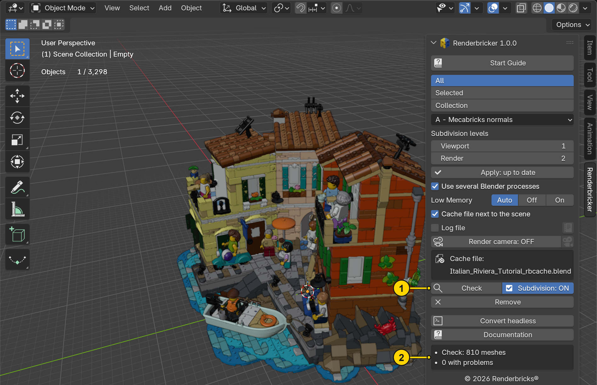

**Check:** the result reads *810 meshes, 0 with prob­lems* (2). If a part is listed, the arrow next
to it selects and frames it – see [Trou­bleshoot­ing](TROUBLESHOOTING.md) and
[Known issues](KNOWN_ISSUES.md).

---

## Step 5: Compare with the import

1. Press **Sub­di­vi­sion: ON** – it switches to **OFF** and every link shows the import.
2. Press it again to switch back.

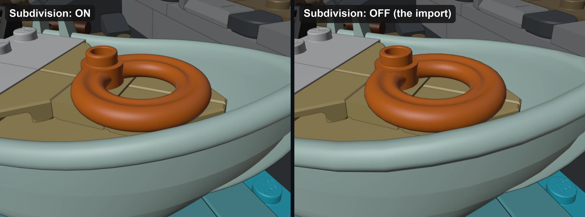

**Check:** round shapes become round – the life ring, the rim of the boat, the studs – while
sharp edges of the real parts stay sharp: the corners of the plates, the edges of the tiles.

---

## Step 6: Render

**What it is for:** F12 renders with the render level – the parts switch to level 2 while the
render runs and back to level 1 afterwards. The render camera sets up a camera, a sky and render
set­tings of its own for quick pic­tures of the model, without touch­ing yours.

1. Press **F12** (or *Render → Render Image (Ren­der­bricker levels)*) – with your own camera, world
   and render set­tings, as with any scene.

For a quick picture of the model, use the **render camera**:

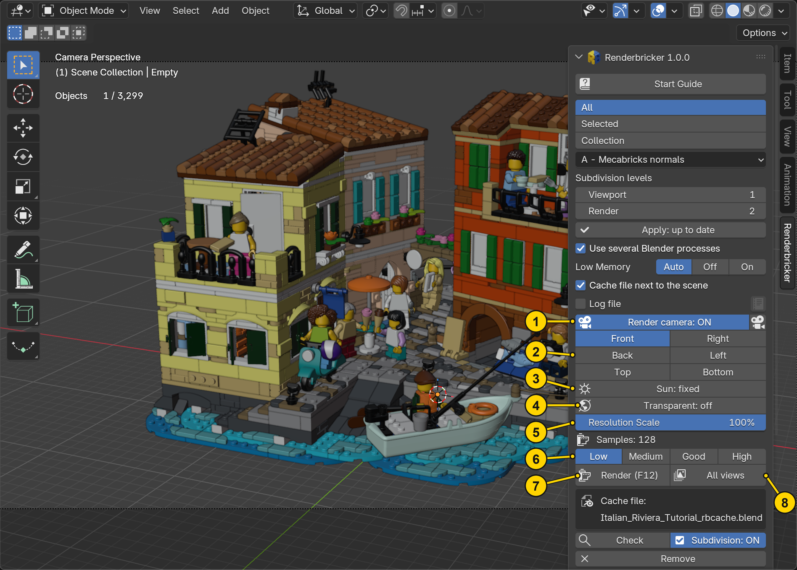

1. **Render camera: ON** creates the camera *Ren­der­bricks*, framing the whole model, and a world
   *Ren­der­bricks Sky* (Phys­i­cal Sky) of its own, and takes over the Ren­der­bricks render settings.
   The view­port looks through the camera, the Prop­er­ties editor shows the *Output* tab. **OFF**
   brings back your camera, world and render set­tings exactly as they were; ON again brings back
   the render camera set­tings you had at the last OFF.
2. **Front, Right, Back, Left, Top, Bottom** turn the camera around the model and frame it again.
   For *Bottom* the sky is mir­rored, so the sun lights the underside.
3. **Sun: fixed** keeps the sun in place; *turns with the camera* lights every view like Front.
4. **Trans­par­ent** leaves the sky out of the picture (alpha), glass included.
5. **Res­o­lu­tion Scale** – e.g. 50 % for quick tests.
6. **Samples:** *Low* 128 (the start), *Medium* 256, *Good* 512, *High* 1024.
7. **Render (F12)** renders the current view into its own slot of the Render window.
8. **All views** renders the six views one after the other, each into its slot (Slot 1 Front …
   Slot 6 Bottom). **Esc** in the Render window stops the chain.

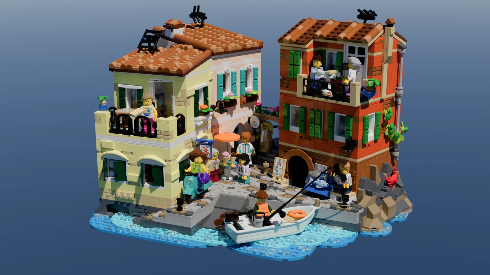

**Check:** the render shows the smooth render level (above: the Front view at *Low*, 1920 × 1080,
105 seconds on an RTX 5090 includ­ing the switch to level 2). *All views* at 50 % gives the six
slots below in about two minutes.

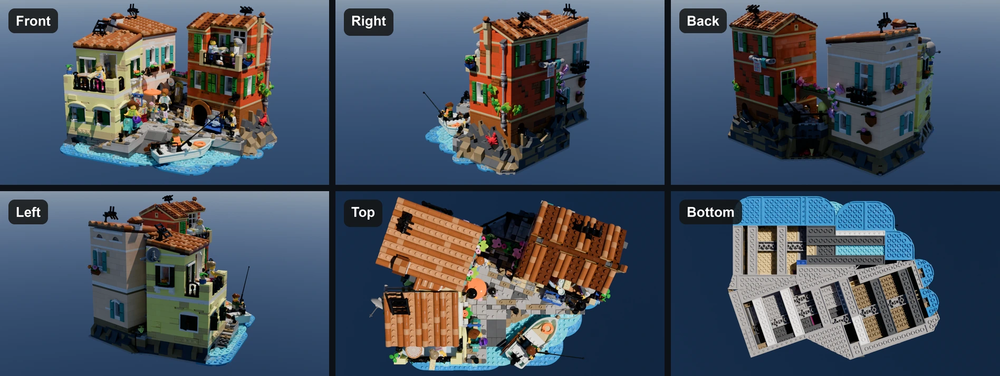

### The quality in detail

The same Front view at 8K (7680 × 4320) with 512 samples – about five minutes on an RTX 5090 – and
four parts of it at full size (1:1):

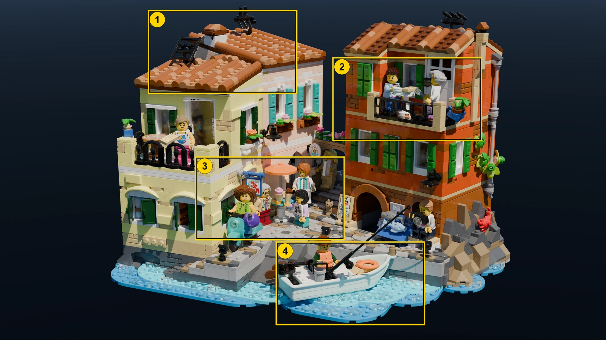

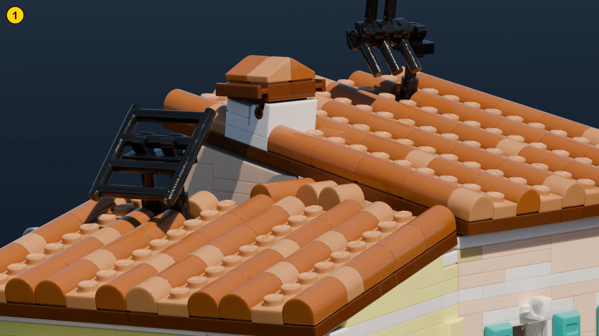

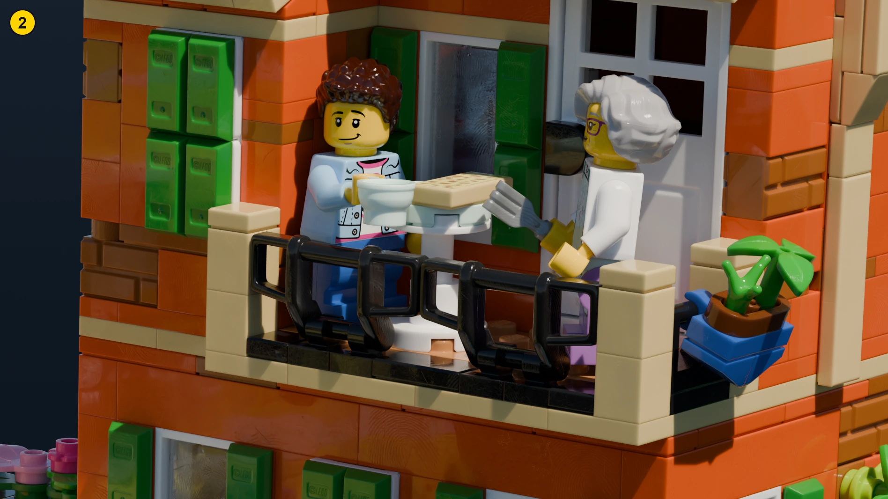

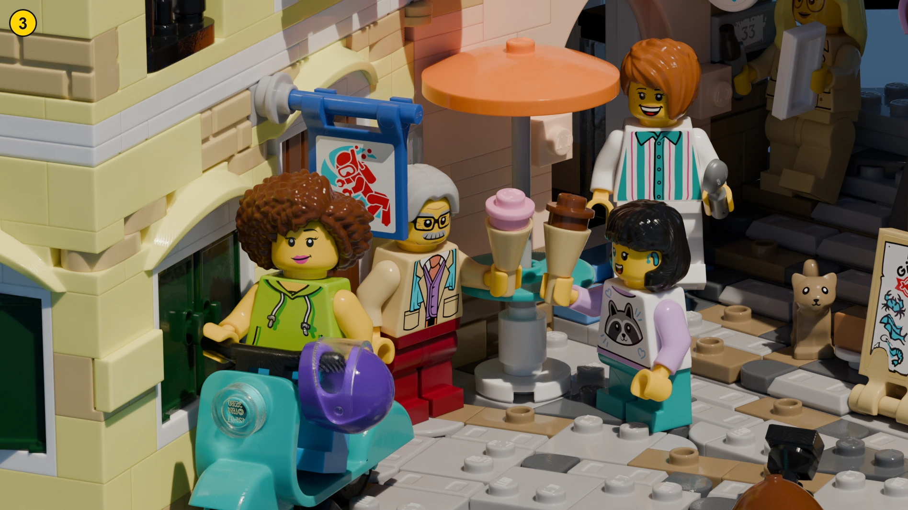

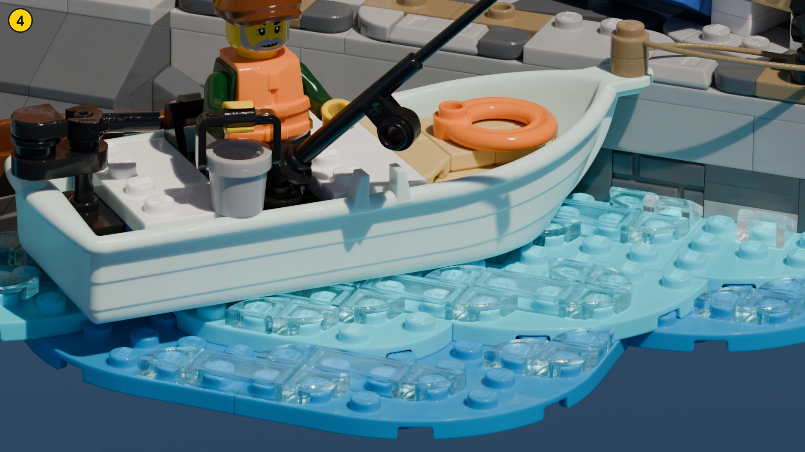

Round shapes are round – the tiles, the life ring, the rim of the boat, the studs with their logo –
while the edges that are sharp on the real bricks stay sharp.

---

## Step 7: Save As and the cache file

**What it is for:** the copies live in `<scene>_rbcache.blend`. When you save the scene under
another name or in another folder, the new file still links the old cache.

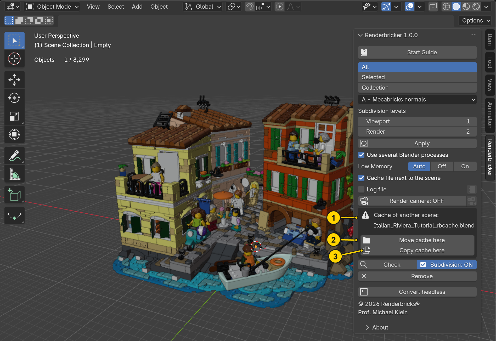

1. After *Save As*, the panel shows **Cache of another scene** and the name of that cache.
2. Press **Move cache here** to take the cache along – the old scene then has none.
3. Or press **Copy cache here** to keep one cache for each file.

**Check:** the panel shows *Cache file:* with the new name, e.g.
`Italian_Riviera_Tutorial_SaveAs_rbcache.blend`.

---

## Step 8: Large scenes: Convert headless

**What it is for:** scenes with thou­sands of parts convert faster without the window, and Blender
stays free for other work meanwhile.

1. Press **Convert head­less** and confirm with **OK**. The scene is saved first.

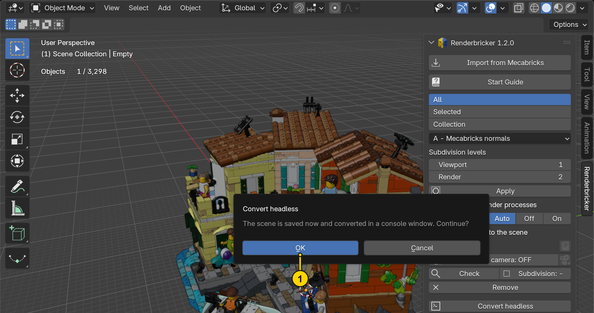

A ter­mi­nal opens and shows the progress. The open scene is not changed; the result is written next
to it as a new file:

```
Italian_Riviera_Headless.blend  →  Italian_Riviera_Headless_subdiv_1-0-0.blend
```

The ter­mi­nal of the Italian Riviera (the middle short­ened, the paths with …):

```
Renderbricker 1.0.0: converting "…\Italian_Riviera_Headless.blend"
Result: "…\Italian_Riviera_Headless_subdiv_1-0-0.blend"

…
PROGRESS [############################# ] 790/810 meshes   97.0 %  elapsed 1:17  left ~0:02  3666.004
PROGRESS [##############################] 810/810 meshes  100.0 %  elapsed 1:22  left ~0:00  15573.007
MERGE copies of the workers (bake 84 s)
CACHE 1620 copies in …\Italian_Riviera_Headless_subdiv_1-0-0_rbcache.blend (23 s)
MERGE loaded and linked 23 s
MERGE cleaned 0 s
SAVED …\Italian_Riviera_Headless_subdiv_1-0-0.blend (1 s)

Done: "…\Italian_Riviera_Headless_subdiv_1-0-0.blend"
Press any key to continue . . .
```

**Check:** the ter­mi­nal ends with *Done* and the name of the result – for the Riviera after about
two minutes. Open that file – it is
con­verted like after Apply (step 3), with its own cache file.

---

## Step 9: Remove

1. Press **Remove** (1) to take the scene back to the plain import.

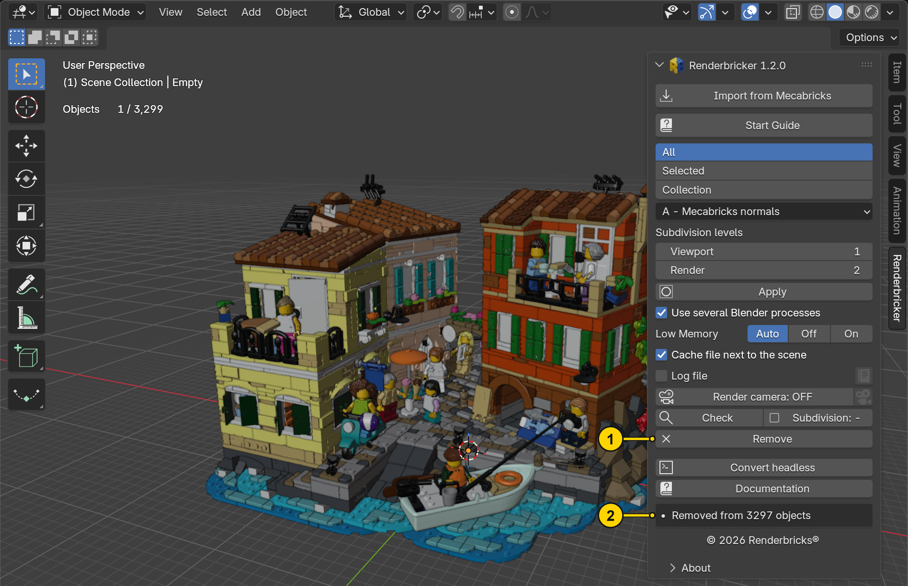

**Check:** the summary reads *Removed from 3297 objects* (2), and the button reads
**Sub­di­vi­sion: -**. The copies are gone from the scene; the cache file stays on the disk until you
delete it.

---

Next: all set­tings in the [Ref­er­ence](REFERENCE.md); the rules and where each comes from in
[RULES.md](RULES.md).

</div>
