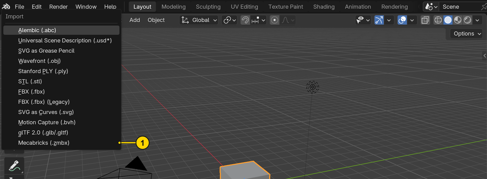

<div align="justify">

# Tutorial – from a Mecabricks scene to smooth, render-ready parts

<!-- Pictures: Blender 5.2.2, the Italian Riviera, yellow numbered markers, 1896 px wide (the text
column at 2x); made with the scripts in _CLAUDE_/scripts/tutorial (local). -->

[](images/tutorial/T07_compare.webp?raw=true)

> **Built on Mecabricks.** [Mecabricks](https://www.mecabricks.com) by **Nicolas 'Scrubs' Jarraud**
> is where the models are built: a con­struc­tion kit for digital LEGO® models in the web browser,
> with a library of thou­sands of parts. His Blender add-ons **Mecabricks Advanced** and **Mecabricks Lite** bring a
> model into Blender with its materials. Ren­der­bricker starts where the import ends: it makes the
> imported parts smooth for ren­der­ing, without chang­ing them.

**What you will learn:** con­vert­ing a Mecabricks scene so that round shapes render round and sharp
edges stay sharp; check­ing and com­par­ing the result; ren­der­ing it with your own camera or the
render camera; keeping the cache file with the scene; con­vert­ing large scenes in the back­ground;
and going back to the plain import.

**You need:** Blender 4.5 LTS or newer, the Mecabricks Lite or Advanced add-on and Ren­der­bricker ([Step 0](#step-0-install-renderbricker)). The example is the
[*Italian Riviera*](https://www.mecabricks.com/en/models/qxv4E8VdadJ) by Nicolas 'Scrubs' Jarraud:
3297 parts of 810 dif­fer­ent kinds.

**Time:** about 15 minutes; the con­ver­sion itself takes under 2 minutes for this scene.

**The times in this tuto­rial** were mea­sured on this com­puter – yours will differ:

| Component | Tutorial computer |
|---|---|
| Computer | XMG NEO (E25) laptop |
| Processor | Intel Core Ultra 9 275HX, 24 cores |
| Memory | 96 GB DDR5-5600 |
| Graphics | NVIDIA GeForce RTX 5090 Laptop GPU, 24 GB (renders with OptiX) |
| System | Windows 11 Pro, Blender 5.2.2 LTS |
| Scene files | on an external USB hard disk (WD Elements) – loading and saving are faster on an SSD |

The con­ver­sion runs on the pro­ces­sor: Ren­der­bricker starts one Blender process per two cores, as many
as the free memory allows – here twelve. The graph­ics card only matters for rendering.

**Four words used below:**

| Word | Meaning |
|---|---|
| *part* | one kind of LEGO® element in the scene – its **mesh** (the 3D shape) |
| *link* | a brick in the scene: an object that shows a part; the Riviera has 3297 links of 810 parts |
| *copy* | the smoothed version of a part that Renderbricker bakes; all links of the part use it |
| *crease* | how sharp an edge stays when the surface is smoothed |

More in the [Glos­sary](GLOSSARY.md).

**How it works:** Mecabricks parts are mod­elled for display in real time – flat faces, hard
corners, round shapes made of a few segments. A sub­di­vi­sion surface makes them smooth, but without
guid­ance it rounds every­thing and a brick looks like soap. Ren­der­bricker first decides for every
edge whether the real part is sharp or round there, fol­low­ing a rule set that was checked part by
part against photos of the real ele­ments, and sets a crease on the sharp ones. Then it bakes the
smoothed result into a copy of each part. The imported mesh stays untouched in the file.

**Every step** has the same parts: **what it is for**, the **actions** (num­bered like the yellow
markers in the picture), a **check** that tells you it worked, and some­times a **why**.

Steps: [0 Install](#step-0-install-renderbricker) · [1 Import](#step-1-import-from-mecabricks-and-save) ·
[2 Set­tings](#step-2-the-settings-at-a-glance) · [3 Apply](#step-3-apply) ·
[4 Compare](#step-4-compare-with-the-import) · [5 Check](#step-5-check) · [6 Render](#step-6-render-with-f12) ·
[7 Render camera](#step-7-the-render-camera) · [8 Save As](#step-8-save-as-and-the-cache-file) ·
[9 Large scenes](#step-9-large-scenes) · [10 Remove](#step-10-remove) ·
[Going further](#going-further) · [Summary](#summary)

---

## Step 0: Install Renderbricker

**What it is for:** the add-on adds the panel *Ren­der­bricker* to the sidebar of the 3D viewport.


**[⬇ Down­load renderbricker-*version*.zip](https://github.com/Renderbricks/Renderbricker/releases/latest)** (latest release)

1. *Edit → Pref­er­ences → Add-ons*, open the menu at the top right and choose
   **Install from Disk…**, then pick the zip.
2. Tick **Ren­der­bricker** to enable it.

**Check:** in the 3D view­port, press **N** – the sidebar has a tab **Ren­der­bricker**.

---

## Step 1: Import from Mecabricks and save

**What it is for:** Ren­der­bricker works on a scene imported from Mecabricks and writes its copies
into a cache file next to the scene – so the scene needs a file first.



1. In [Mecabricks](https://www.mecabricks.com), export the model for Blender – a `.zmbx` file.
2. In Blender: *File → Import → **Mecabricks (.zmbx)*** (1) (Mecabricks Lite or Advanced add-on) and
   pick the file.
3. Save the scene (*File → Save As*). Ren­der­bricker offers the name of the imported model; the cache
   file will carry the same name:

   ```
   Italian_Riviera_Tutorial.blend  →  Italian_Riviera_Tutorial_rbcache.blend
   ```


4. Press **N** in the 3D view­port and click the tab **Ren­der­bricker** (1).

**Check:** the title bar of the Blender window shows the file name.

> **Start Guide** (2) leads through the same steps inside Blender, one at a time, and shows when a
> step is done – here with the saved file name (3):
>
> 

---

## Step 2: The settings at a glance

**What it is for:** knowing what the defaults do. They suit most scenes – for the Italian Riviera
all of them stay as they are.


| | Setting | Default | In short |
|---|---|---|---|
| 1 | Scope | **All** | which parts: all, the selected ones, or chosen collections |
| 2 | Variant | **A – Mecabricks normals** | keeps the shading of the import; *B* gives crisper logos on the studs |
| 3 | Levels | **Viewport 1 / Render 2** | smooth enough to work with, full quality in the render |
| 4 | Several Blender processes | **on** | larger scenes are converted by several Blenders at once |
| 5 | Low Memory | **Auto** | only for very large parts or little memory – see [Going further](#low-memory) |
| 6 | Cache file | **on** | the copies go into a file of their own, the scene file stays small |

**Why two levels:** level 2 has three to four times the faces of level 1. The view­port stays fast
with level 1, and F12 switches to level 2 only while it renders.

---

## Step 3: Apply

**What it is for:** Apply sets the creases and bakes the smoothed copy of every part.

1. Press **Apply**.


A progress bar shows the parts done and the time left (1); **Esc** cancels (2). Blenders in the
back­ground share the work – for the Italian Riviera twelve of them con­verted the 810 parts in
87 seconds. At the end the scene is saved.


**Check:** the summary lists what was done (1): 810 meshes for 3297 objects, the time, the set­tings
and the copies written into the cache file. **Sub­di­vi­sion: ON** (2) shows that the links use the
copies, and the panel names the cache file (3). *Apply* now reads **Apply: up to date**.

**Why a copy:** the imported mesh is never changed. Each part is smoothed once, not once per brick –
the Riviera's 3297 links share 810 copies.

---

## Step 4: Compare with the import

**What it is for:** seeing what Ren­der­bricker changed – and that the import is still there.

1. Press **Sub­di­vi­sion: ON** – it switches to **OFF** and every link shows the import.
2. Press it again to switch back.


**Check:** round shapes become round – the life ring, the rim of the boat, the studs – while the
edges that are sharp on the real parts stay sharp: the corners of the plates, the edges of the tiles.

---

## Step 5: Check

**What it is for:** finding faces that folded over or seams that opened – before you render.

1. Press **Check** (1).


**Check:** the result reads *810 meshes, 0 with prob­lems* (2). If a part is listed, the arrow next
to it selects and frames it – see [Trou­bleshoot­ing](TROUBLESHOOTING.md) and
[Known issues](KNOWN_ISSUES.md).

---

## Step 6: Render with F12

**What it is for:** ren­der­ing with your own camera, world and set­tings – in full quality.

1. Press **F12** (or *Render → Render Image (Ren­der­bricker levels)*).

**Check:** the render shows the smooth level 2; the view­port stays at level 1 – the parts switch
only while the render runs.

---

## Step 7: The render camera

**What it is for:** a quick picture of the model from six sides – with a camera, a sky and render
set­tings of its own, without touch­ing yours.


1. **Render camera: ON** creates the camera *Ren­der­bricks* framing the whole model and the world
   *Ren­der­bricks Sky*. **OFF** brings back your camera, world and set­tings exactly as they were.
2. **Front … Bottom** turn the camera around the model and frame it again.
3. **Sun: fixed** keeps the sun in place; *turns with the camera* lights every view like Front.
4. **Trans­par­ent** leaves the sky out of the picture, glass included.
5. **Res­o­lu­tion Scale** – e.g. 50 % for quick tests.
6. **Samples:** *Low* 128 (the start), *Medium* 256, *Good* 512, *High* 1024.
7. **Render (F12)** renders the current view into its own slot of the Render window.
8. **All views** renders the six views one after the other; **Esc** stops the chain.


**Check:** the Front view at *Low* (1920 × 1080, 105 seconds on an RTX 5090 includ­ing the switch to
level 2). *All views* at 50 % gives the six slots below in about two minutes.


### The quality in detail

The same view at 8K (7680 × 4320) with 512 samples – about five minutes on an RTX 5090 – and four
parts of it at full size. Click a detail for a 4K section around it; the over­view down­loads the
whole 8K render (1.8 MB):

[](https://github.com/Renderbricks/Renderbricker/releases/download/v1.0.0/Italian_Riviera_8K_512_samples.webp)

[](https://raw.githubusercontent.com/Renderbricks/Renderbricker/main/docs/images/tutorial/T08c_crop1_4k.webp)

[](https://raw.githubusercontent.com/Renderbricks/Renderbricker/main/docs/images/tutorial/T08c_crop2_4k.webp)

[](https://raw.githubusercontent.com/Renderbricks/Renderbricker/main/docs/images/tutorial/T08c_crop3_4k.webp)

[](https://raw.githubusercontent.com/Renderbricks/Renderbricker/main/docs/images/tutorial/T08c_crop4_4k.webp)

---

## Step 8: Save As and the cache file

**What it is for:** the copies live in `<scene>_rbcache.blend`. A scene saved under another name or
in another folder still links the old cache – here you decide where it belongs.


1. After *Save As*, the panel shows **Cache of another scene** and its name.
2. **Move cache here** takes the cache along – the old scene then has none.
3. **Copy cache here** keeps one cache for each file.

**Check:** the panel shows *Cache file:* with the new name, e.g.
`Italian_Riviera_Tutorial_SaveAs_rbcache.blend`.

---

## Step 9: Large scenes

**What it is for:** scenes with thou­sands of parts convert in the back­ground – Blender stays free
mean­while, and the open scene is not changed.

1. Press **Convert head­less** and confirm with **OK**. The scene is saved first.


A ter­mi­nal shows the progress; the result is written next to the scene as a new file:

```
Italian_Riviera_Headless.blend  →  Italian_Riviera_Headless_subdiv_1-0-0.blend
```

The end of the ter­mi­nal for the Italian Riviera:

```
PROGRESS [##############################] 810/810 meshes  100.0 %  elapsed 1:22  left ~0:00  15573.007
MERGE copies of the workers (bake 84 s)
CACHE 1620 copies in …\Italian_Riviera_Headless_subdiv_1-0-0_rbcache.blend (23 s)
SAVED …\Italian_Riviera_Headless_subdiv_1-0-0.blend (1 s)

Done: "…\Italian_Riviera_Headless_subdiv_1-0-0.blend"
```

**Check:** the ter­mi­nal ends with *Done* and the name of the result. Open that file – it is con­verted
like after Apply, with its own cache file.

---

## Step 10: Remove

**What it is for:** going back to the plain import – nothing Ren­der­bricker did stays in the scene.

1. Press **Remove** (1).


**Check:** the summary reads *Removed from 3297 objects* (2), and the button reads
**Sub­di­vi­sion: -**. The cache file stays on the disk until you delete it.

---

## Going further

### Only some collections

A large scene can be con­verted piece by piece.


1. Choose **Col­lec­tion**. The list starts empty.
2. Click the col­lec­tion in the Out­liner and press **+**; **−** takes the selected entry out of the list.
3. The **camera icon** marks a col­lec­tion for the render camera: with the camera on, only the marked
   col­lec­tions are shown and rendered.

Parts outside the chosen col­lec­tions stay as imported; Apply con­verts only what is not up to date.

### Levels above 2


Every level has three to four times the faces of the one below. A level above 2 is asked first:
**Use level 3** (1) sets it, **Cancel** (2) keeps the level you had.

### Low Memory

How the Blender pro­cesses share the parts. *Off* gives each its share at once – the fastest way.
*On* cuts the parts into small seg­ments, each done by a Blender that ends after­wards and frees its
memory – slower, but safe on com­put­ers with 16 or 32 GB or with very large parts. *Auto* switches it
on only when a single part is so large that oth­er­wise just a few Blenders could run.

### Log file

**Log file** writes the results of Apply, Check and Convert head­less, with the full list of
prob­lems, into `<scene>_Renderbricker.log` next to the scene.

---

## Summary

- **Apply** smooths every part once; all bricks of that part share the copy.
- **Sub­di­vi­sion ON/OFF** com­pares with the import, **Check** finds prob­lems before you render.
- **F12** renders at the render level; the **render camera** gives quick pic­tures without touch­ing
  your setup.
- The copies live in the **cache file** next to the scene – after *Save As*, move or copy it.
- **Convert head­less** handles large scenes in the back­ground; **Remove** goes back to the import.

Next: all set­tings in the [Ref­er­ence](REFERENCE.md); the rules and where each comes from in
[RULES.md](RULES.md).

---

## Credits and trademarks

- [Mecabricks](https://www.mecabricks.com) and the Blender add-ons Mecabricks Advanced and
  Mecabricks Lite: devel­oper and creator Nicolas 'Scrubs' Jarraud.
- Example scene: [Italian Riviera](https://www.mecabricks.com/en/models/qxv4E8VdadJ) by Nicolas
  'Scrubs' Jarraud – used with his kind permission. Thank you!
- Ren­der­bricks® is a reg­is­tered word mark in Germany.

Trans­parency note on the use of AI: the author is not a pro­gram­mer but has worked in CGI since 1987. The add-on was devel­oped entirely through vibe coding with Anthropic Claude (Claude Code): Claude wrote the code, the tests and this doc­u­men­ta­tion from his descriptions. The concept, the design deci­sions, the rules checked against the real LEGO parts, the tests in Blender and the accep­tance of every version are the author's; he is respon­si­ble for the content.

LEGO® is a trade­mark of the LEGO Group; all other names and marks men­tioned here belong to their owners, none of whom spon­sors, autho­rizes or endorses this project.

</div>
